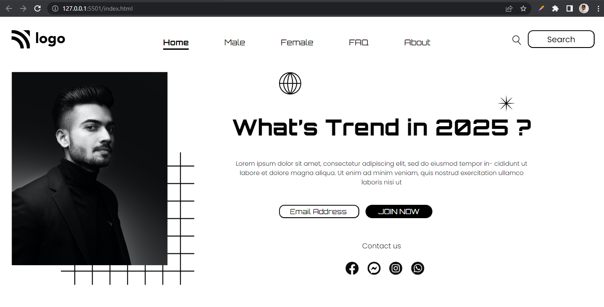

# Assignment 1

## Project 1 [Live Link](https://nachiketkeripaleproject1.netlify.app/)

-   Lerned to use css position Relative & Absolute property.

---

## Time taken to finish this project

-   3 hour to complete it.

#### Screenshot

 

